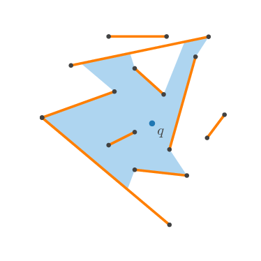

# Visibility Regions Merge

GPU parallel visibility algorithm to compute the visibility region of a point into a set of segments using [GPU Merge Path](http://www.cc.gatech.edu/~bader/papers/GPUMergePath-ICS2012.pdf).

The algorithm is inspired by mergesort. You can see a demonstration in [this jupyter notebook](../notebook/notebook/VisibilityRegionsMerge.ipynb).

The algorithm was first described in this paper: [Cascading Divide-and-Conquer: A Technique for Designing Parallel Algorithms](https://epubs.siam.org/doi/abs/10.1137/0218035).

A paper about this algorithm has been published here: [GPU Parallel Visibility Algorithm for a Set of Segments Using Merge Path](https://www.sciencedirect.com/science/article/pii/S1571066119300052).
